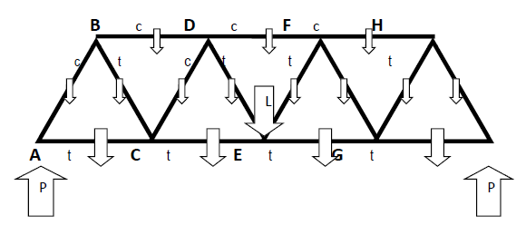

# Truss Analysis



(Adapted from *Introduction to Programming with Java: A Problem-Solving Approach*, Dean and Dean, McGraw-Hill.) 

A good way to support weight on a bridge is to use a truss structure, shown in the attached image file. For simplicity, we discuss the situation as though there were just one truss. Actually, of course, there are two – one on either side of the road. The loadings we use apply to the whole bridge, so when we conclude that a particular member has a certain load, that load is actually carried by two identical members – one on either side of the road.

In the image, solid lines are steel members, and white arrows are forces. The large up arrow (labeled P) below each end is the pier force, `pierForce`, that supports one end of the bridge. The large down arrow in the center (labeled L) is the weight of a load halfway across the bridge, `centerLoad`. Each medium-sized down arrow across the bottom represents the weight of the road and bottom structural members in one of the four sections of the bridge, `roadWeight`. Each small arrow represents the weight of an above-road structural member, `structuralWeight`.

Each junction is identified by a bold capital letter (A through I), and each structural member is identified by a unique pair of these letters. The small lower-case letters in the figure indicate whether a particular steel member is in tension (t) or compression (c). All the bottom (road-level) members are in tension, all the top members are in compression (negative tension), and the diagonal members alternate between tension (insides) and compression (outsides). 

Since the bridge is stationary, there is no acceleration, and we can analyze it by noting that at each junction, the total force upward must equal zero, and the total force to the right must equal zero. The problem is symmetrical, so it’s sufficient to analyze half of the bridge. Let’s start with vertical forces and go from junction E back to junction A. 

The vertical force exerted by diagonal DE on junction E is `upForceOnEbyDE = centerLoad/2 + roadWeight/2`.

The `centerLoad` is divided by 2 because this load is shared by DE and EF. The `roadWeight` is divided by 2 because half the weight of CE is carried by BC. DE is in tension, so its vertical force on junction E is upward and the sign of this force is positive.

The vertical force exerted by diagonal DE on junction D is `upForceOnDbyDE = -upForceOnEbyDE  – structuralWeight`.

The negative signs indicate a reversed and downward force direction, respectively. The `structuralWeight` term accounts for DE’s own weight.

The vertical force exerted by the diagonal CD on junction D is `upForceOnDbyCD = -upForceOnDbyDE + structuralWeight`.

CD is in compression, so its vertical force on junction D is upward. The `structuralWeight` is half the weight of DF plus half the weight of BD.  

Continuing in this fashion, we also have:
```
upForceOnCbyCD = -upForceOnDbyCD – structuralWeight
upForceOnCbyBC = -upForceOnCbyCD + roadWeight
upForceOnBbyBC = -upForceOnCbyBC – structuralWeight
upForceOnBbyAB = -upForceOnBbyBC + structuralWeight/2
upForceOnAbyAB = -upForceOnBbyAB - structuralWeight
pierForce = -upForceOnAbyAB + roadWeight/2
```
Because AB is sloping, its compressive force pushes down not only on junction A. It also pushes to the left, and this leftward horizontal force is exactly balanced by a rightward horizontal force exerted by AC. This particular truss employs equilateral triangles, so each of its internal angles is 60 degrees. Either trigonometry or the Pythagorean theorem says that the tensile force along the axis of any across-the-road diagonal pair is equal to 1/sin(60) = 2/sqrt(3) = 1.1547 times the vertical force exerted on the upper end of that member. Thus,
```
tensionAtAinAB = 1.1547 * upForceOnAbyAB
tensionAtBinBC = -1.1547 * upForceOnBbyBC
tensionAtCinCD = 1.1547 * upForceOnCbyCD
tensionAtDinDE = -1.1547 * upForceOnDbyDE
```
Also, the horizontal force exerted by any diagonal member is equal to half the axial force or 1/tan(60) = 1/sqrt(3) = 0.57735 times the vertical force exerted by that member. This gives us equations for the forces in the horizontal members:
```
rightForceOnAbyAC = -0.57735 * upForceOnAbyAB
rightForceOnCbyAC = -rightForceOnAbyAC
rightForceOnCbyCE = -rightForceOnCbyAC + 0.57735 * (upForceOnCbyBC - upForceOnCbyCD)
rightForceOnBbyBD = -0.57735 * (upForceOnBbyAB – upForceOnBbyBC)
rightForceOnDbyBD = -rightForceOnBbyBD
rightForceOnDbyDF = -rightForceOnDbyBD -0.57735 * (upForceOnDbyCD – upForceOnDbyDE)
```
Since the horizontal forces are along the axes of the horizontal members, we have:
```
tensionAtAinAC = rightForceOnAbyAC
tensionAtCinCE = rightForceOnCbyCE
tensionAtBinBD = rightForceOnBbyBD
tensionAtDinDF = rightForceOnDbyDF	
```

Write a program that accepts input for `centerLoad`, `roadWeight`, and `structuralWeight`. Your program should calculate the value of `pierForce`, plus the tension in all members of the truss. This does not involve fancy mathematics. Just evaluate the expressions and make the assignments in the order in which they have been presented above, using results of previous calculations for the next one. 

Sample session:

```
Enter center load in lbs: 20000
Enter weight of one section of road in lbs: 2000
Enter weight of structural member in lbs: 500

Support for half of bridge = 16750 lbs.
Total tension in BD = -17464 lbs.
Total tension in DF = -31032 lbs.

Total tension in AB = -18186 lbs.
Total tension in BC = 17320 lbs.
Total tension in CD = -14433 lbs.
Total tension in DE = 13279 lbs.

Total tension in AC = 9093 lbs.
Total tension in CE = 24681 lbs.
```
